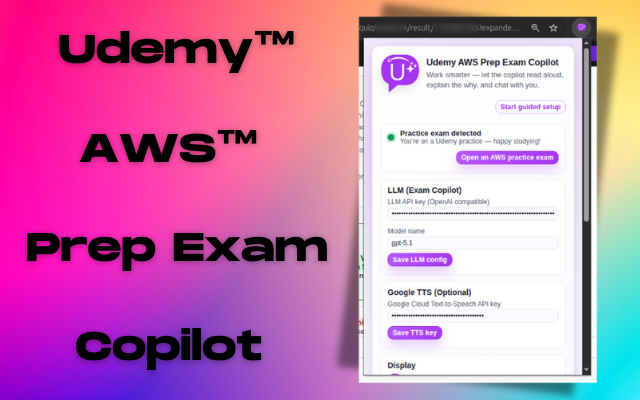
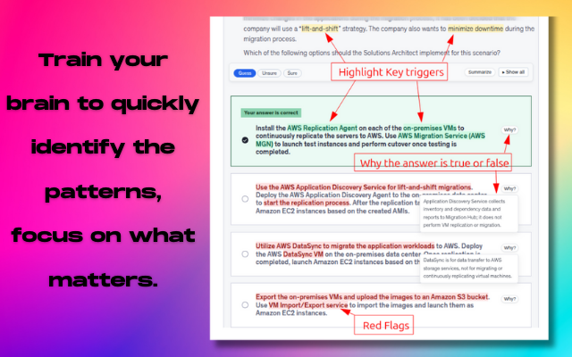
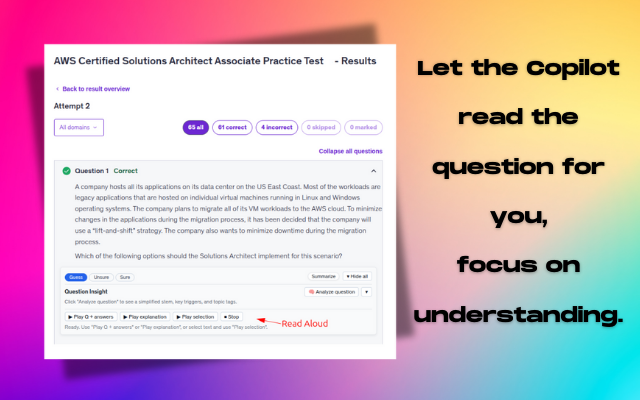
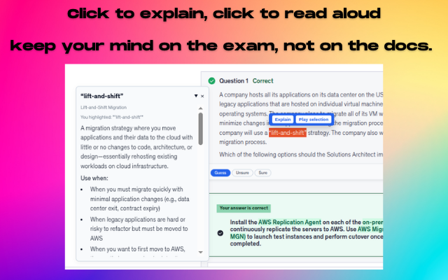
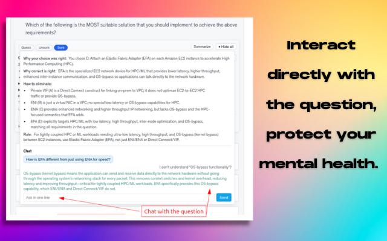

# Udemy AWS Prep Exam Copilot

Chrome extension to read, summarize, and chat through Udemy AWS practice exams. It highlights answers, explains the “why,” reads questions aloud, and keeps your data local.

### Walkthrough (video)

## At a glance
- Guided setup wizard for keys and usage
- LLM insights (chat, summaries, explanations)
- Optional Google Cloud Text-to-Speech for audio
- Keyword highlighting and “Why?” bubbles
- Weak-topic tracking (local only)
- Page detector with one-click link to AWS practice exams

## Quick start
1. **Load unpacked:** `chrome://extensions` → enable **Developer mode** → **Load unpacked** → select this folder.
2. **Add keys:** In the popup, add your OpenAI-compatible LLM API key (required) and model. Optionally add a Google TTS key.
3. **Open a quiz:** Visit a Udemy AWS practice exam (`/learn/quiz/.../result` or `/test#...`). The popup status dot turns green when you’re on a valid page.
4. **Use the tools:** Toggle highlights/“Why?” bubbles, ask for summaries, or trigger read-aloud.

## Configure (details)
- **LLM:** Required. Paste an OpenAI-compatible API key and model name.
- **TTS (optional):** Add a Google Cloud Text-to-Speech key to enable audio playback.
- The guided setup in the popup highlights where to click and what to fill.

## Privacy
- Data lives in Chrome storage; there are no extension-owned servers.
- Your API keys stay in your browser; requests go directly to the providers you configure.
- You control the data sent to LLM/TTS APIs—avoid sending sensitive content.

## Development
- Manifest v3; popup lives in `popup.html`, `css/styles.css`, `src/popup.js`.
- Content scripts listed in `manifest.json`; no build step required for the popup.
- Keep secrets out of source control.

## Contributing
Have feedback, bugs, or ideas for new features? Share them on GitHub—or open a PR—at https://github.com/MarvinAmine/UDEMY_AWS_PREP_EXAM_COPILOT. I review and ship improvements and welcome collaboration. See `CONTRIBUTING.md` and `CODE_OF_CONDUCT.md`.

## Screenshots

### Guided setup and keys

### Highlight, explain, read aloud

### Chat and summarization

## License
MIT License. See `LICENSE`.
